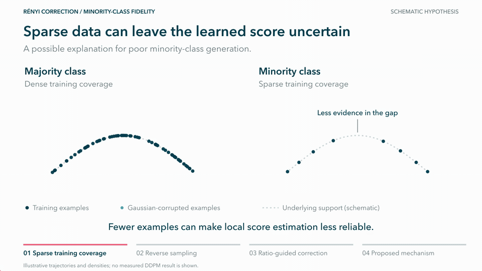

# Rényi sampling

Standalone code for training GMM and stacked-MNIST diffusion models from scratch
and sampling with Rényi corrections.

## Rényi Correction Schematic


Conceptual illustration of the proposed mechanism.

[Watch the full-quality video](docs/renyi-minority-fidelity.mp4)

## Files

- `GMM.py`: eight-component imbalanced mixtures in 2, 8, 16, 32 and 64 dimensions.
- `MNIST.py`: stacked-digit data, DDPM/classifier training, ratio fitting and sampling.
- `RenyiSampler.py`: shared predictors, correctors, mobility and ratio estimators.
- `GMM_utils.py`: vector models, mixture kernels, training and sampling orchestration.
- `MNIST_utils.py`: stacked-digit data, networks, evaluation and sampling helpers.
- `sampling_utils.py`: common seeds, schedules and artifact I/O.
- `tests/`: CPU checks without downloaded data or checkpoints.

## Setup

Use Python 3.11 or 3.12. Full training and sampling require an NVIDIA CUDA GPU;
CPU tests also work on macOS.

```sh
python3 -m venv .venv
source .venv/bin/activate
python -m pip install -r requirements.txt
python -m unittest discover -s tests -v
```

For CUDA 12.8, install the matching PyTorch wheels first:

```sh
python -m pip install torch==2.8.0 torchvision==0.23.0 --index-url https://download.pytorch.org/whl/cu128
python -m pip install -r requirements.txt
```

Run commands from the repository root. Data and new experiment outputs are
created under `outputs/`, which Git ignores. No external experiment checkout is
required. Compiler cache locations can be overridden with
`TORCHINDUCTOR_CACHE_DIR` and `TRITON_CACHE_DIR`.

## GMM

```sh
python GMM.py --test
python GMM.py --dims 2 8 16 32 64 --train-only
python GMM.py --dims 2 8 16 32 64
```

Training generates data and trains for 15,000 updates per dimension. The full
command uses those newly trained models for learned-score and analytic-score
sweeps with 5,000 outputs per cell. Output folders are `outputs/GMM/d{dimension}`.
Additional estimators use the models trained by the preceding commands:

```sh
python GMM.py paper --estimator kde --dims 2
python GMM.py paper --estimator discriminator --dims 2
```

## Stacked MNIST

Three digit channels define 1,000 ordered modes. Modes whose ones
digit is 7 share a fixed 1% probability. Official MNIST is downloaded during data
preparation. Training fixes digit triples and redraws handwriting on access.

```sh
python MNIST.py data --train-size 1000000
python MNIST.py train --steps 200000 --train-size 1000000 --batch 128
python MNIST.py discriminator
python MNIST.py sample --samples 10000 --seeds 42 43 44 45 46
```

`python MNIST.py all` runs training (including data preparation and classifier
training), discriminator fitting and sampling in order.

Discriminator pretraining and sampling both use **64 anchors** by default.
`--levels` selects another anchor count; use the same value for `discriminator`
and `sample`. Online critic fitting occurs at the selected sampling anchors.
Samples, per-run metrics, correction diagnostics and unfiltered previews are
saved under `outputs/MNIST/correction_levels64`.

Use `--output-dir` on each command to choose another experiment directory.
Start with an empty directory for fresh training.

`python MNIST.py test` requires the prepared million-example composition.
The CPU tests in `tests/` need no data. See `--help` for predictor-only fidelity
and capacity training/sampling actions.

## Outputs

Scripts save checkpoints, samples and per-run numerical measurements under
the selected output directory.

The data/training seed defaults to 20260912; sampling seeds are 42–46. The Rényi
grid is K=0, alpha=1 plus K=1,2,3 crossed with alpha=0.5,0.7,0.9,1,1.1,1.3.
K=0 is predictor-only and alpha=1 gives unit-mobility Langevin correction.
Classifier confidence and mode coverage alone do not establish image quality.
